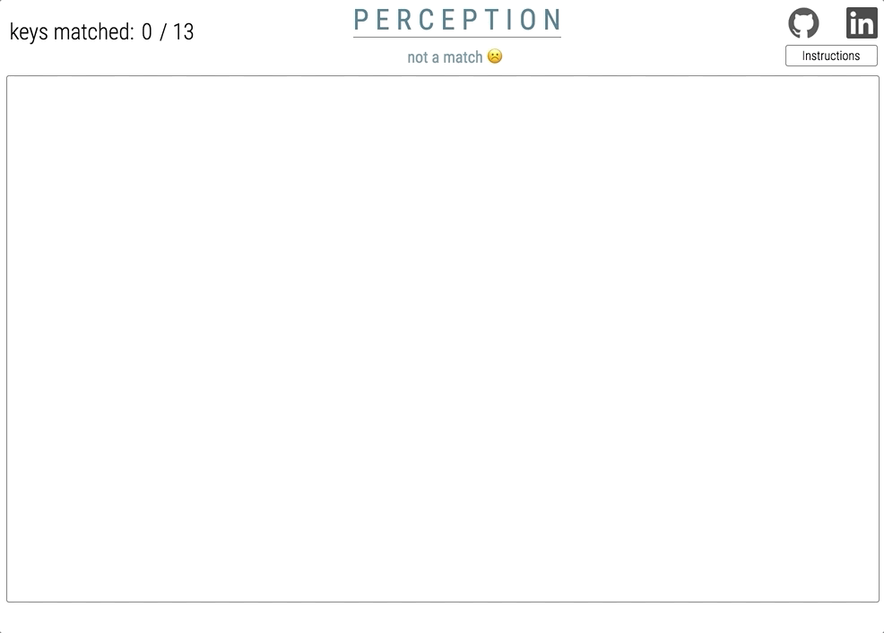
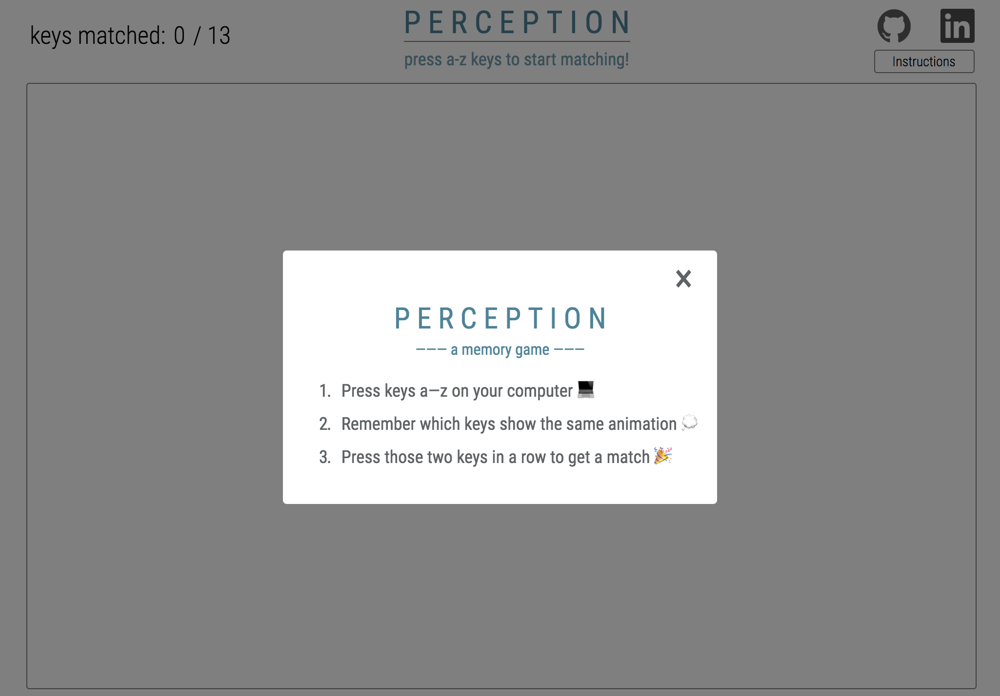
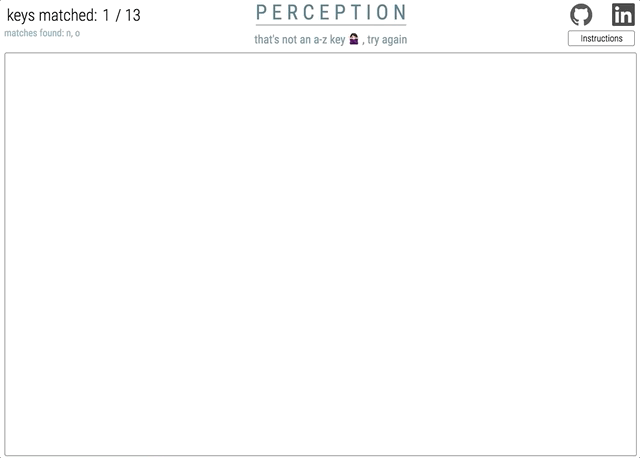
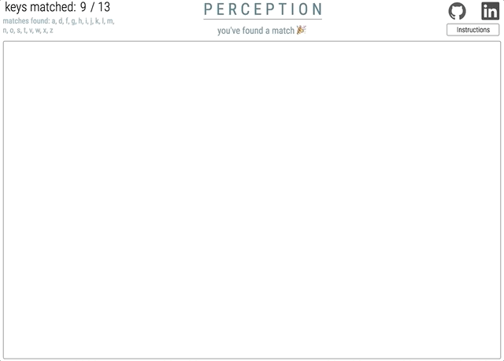

<p align="center"></p>

<h1 align="center">Perception</h1>

<p align="center">
  <a href="https://aguamenti.github.io/Perception/">Click to Play!</a>
  <br>Experience a visual exploration of human perception to moving objects and muscle memory.
</p>

<p align="center">
  <a href="#technologies">Technologies</a> •
  <a href="#background">Background</a> •
  <a href="#key-features">Key Features</a> •
  <a href="#project-design">Project Design</a> •
  <a href="#pending-features">Pending Features</a>
</p>

<p align="center"></p>

# Technologies
- JavaScript
- HTML/CSS, Canvas
- Anime.js library

# Background
Perception: memory game with a twist. One that simultaneously stimulates the hippocampus and sensory cortex.



Upon pressing an alphabet key, an animation will appear on the screen. The player aims to remember which keys have the same associated animation, and to find all 13 matching keys.

###### Be sure to check out how I used a <a href="#finite-state-machine">Finite State Machine</a>! It's super cool.

# Key Features
#### Custom Animations


A novel way to integrate the Anime.js API, positional equations, and HTML5 Canvas:

```js
// the firework animation:
const circles = [];
for ( let i = 0; i < animeVals.numEls; i++ ) {
  const color = animeVals.colors[i];
  circles.push(new Circle( xVals, yVals, color, animeVals, radius ));
}

const animeFireworks = anime({
  targets: circles, // targets objects rather than HTML elements, resulting in more DRY code
  x: cir => { return cir.x + anime.random(-(state.canvas.width), state.canvas.width); },
  y: cir => { return cir.y + anime.random(-(state.canvas.width), state.canvas.width); },
  radius: state.canvas.width / 55,
  duration: animeVals.duration,
  easing: animeVals.easing,
  complete: clearAnimation(state),
});

// the "perceive!" animation
const animePerceive = anime({
  targets: words,
  font: animeVals.font,
  x: () => { return anime.random(state.canvas.width * (1 / 8), state.canvas.width * (7 / 8)); },
  y: () => { return anime.random(state.canvas.height * (1 / 8), state.canvas.height * (7 / 8)); },
  duration: animeVals.duration,
  delay: (el, idx) => { return idx * 80; },
  easing: animeVals.easing,
  complete: clearAnimation(state)
});
```

# Project Design
## Finite State Machine
To implement game logic, a Finite State Machine (an abstract computational model) is used, resulting in a game flow that proceeds depending on a single state that updates depending on external conditions:

```js
// js/animations.js
this.state = { firstKey: null, currentKey: null, currentState: ZERO_KEYPRESSES...};
```

In this case, a Deterministic Finite Automaton is used.

#### Key Matching and Winning


Perception can be in one of 5 current states: ```ZERO_KEYPRESSES```, ```ONE_KEYPRESS```, ```MATCH```, ```NOT_MATCH```, and ```WON```:

```js
switch( state.currentState ) {
  case ZERO_KEYPRESSES:
    // set the message at the top of the page, display animation, change currentState
    matchText = "that's one key, now press the matching one!";
    htmlMessage.innerHTML = matchText;

    state.currentState = ONE_KEYPRESS;
    dispatchAnimation(state);

    break;
  case ONE_KEYPRESS:
    // change currentState depending on match, etc.
  case MATCH:
    // handle keys matched score, message, disabling already matched keys
    // check if won, etc.
  case NOT_MATCH:
    // change state, etc.
  case WON:
    // render won modal, etc.

}
```
The above function is called recursively within some case statements to handle a changed state.

# Pending Features
- Introduce a timer feature, recording how long it takes the user to find 13 matches
- Incorporate a backend so user highscores are saved
- Explore the Howler.js library to add sounds corresponding to each
