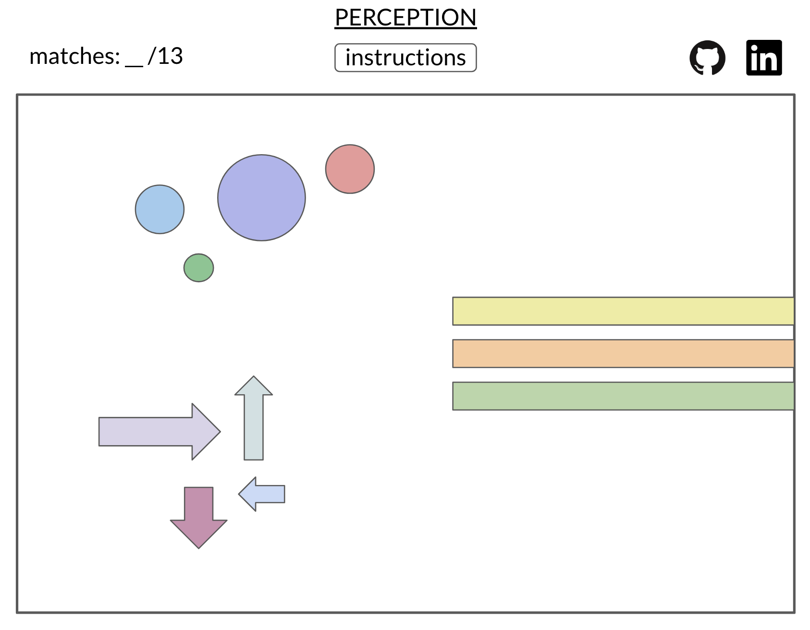

# Perception

## Background and Overview
Perception is a visual and kinesthetic memory game.

Upon pressing an alphabet key on the user's keyboard, an animation will appear on the screen. The user continues to press keys, attempt to remember the animation associated with a specific key, and try to find which keys render the same one.

When a match is found (the keys with the same animation are pressed one after another), the match score at the top left will update.

The goal is to find all 13 matches.

## Functionality & MVP
In Perception, users will be able to:
- [ ] Press their alphabet keys and see animations on the screen
- [ ] Find key matches by pressing the keys with the same animation in succession

In addition, this project will include:
- [ ] Text alerting users that they found a match and a match score
- [ ] An about modal with game instructions

## Technologies
This project will be implemented with the following technologies:

- Vanilla JavaScript for overall structure and game logic
- ```Anime.js```: animation library to render the animations that will correspond to each key press
  - I will still need to design the element, the animation applied to the element, and link each to a key press
- Webpack to bundle and serve up the various scripts

In addition to the webpack entry file, the following scripts will also be involved:

- ```perception.js```: entry file

- ```game.js```: render game procedural logic, Anime.js creation/rendering/deletion

- ```match.js```: handle all game matching/scoring logic

- ```square.js```: square animation

- ```circle.js```: circle animation

- ```triangle.js```: triangle animation

## Wireframes
This app will consist of a single screen with the animation canvas, my Github and LinkedIn, and the instructions modal. All user interaction with the animation will be from the keyboard.



## Timeline
#### Weekend
- [X] Setup ```webpack.config.js``` and ```package.json```
- [X] Configure Anime.js for Perception
- [X] Create half of animations

#### Day1
- [ ] Finish all 13 animations (decide whether to use pure CSS or Canvas)
- [ ] Start synchronization with keys

#### Day2
- [ ] Finish synchronization with keys
- [ ] Make so animations don't overlap: the last animation clears with another keypress

### Day 3
- [ ] Start game logic
  - Render "match" or "not a match" on screen after every two keypresses

#### Day 4
- [ ] Finish game logic
  - [ ] Have an updating match score at the top
  - [ ] Render a winning message when 13/13 matches

#### Day 5
- [ ] Complete instructions modal button
- [ ] Production ReadMe

#### Bonus
- Have multiple levels (start with just one row of 10 keys, 5 matches, progress to more keys)
- Have audio associated with each animation
